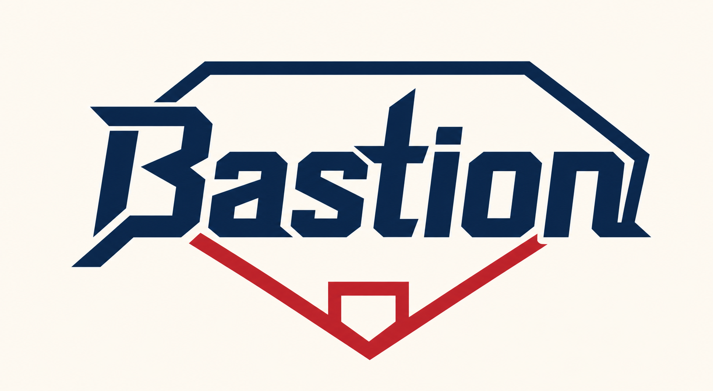

<p align="center">
  
</p>

<h1 align="center">Bastion</h1>

<p align="center">
  面向棒球队的智能管理 Agent：让训练、比赛、阵容与规则知识沉淀为可验证、可追溯的球队资产。
</p>

## 项目简介

Bastion 将交互式 Agent Runtime 与结构化棒球领域 CLI 组合在一起。教练、球员和管理者可以用自然语言完成球队日常工作；所有球队事实由 SQLite 与 Go CLI 统一管理，Agent 负责理解意图、调用受约束的工具并组织结果。

项目当前处于积极开发阶段，主要面向本地运行与功能验证。

## 核心能力

- **球队与球员管理**：维护己方球队、对手、球员资料和训练报告。
- **比赛记录与分析**：记录比赛、阵容、逐回合事件和比分，并生成球员表现分析。
- **阵容工作流**：校验、保存、接受或驳回候选阵容，保留明确的状态流转。
- **训练闭环**：管理训练建议、审批结果与已批准的训练内容。
- **跨周期洞察**：汇总球员在指定时间范围内的比赛与训练表现。
- **棒球规则知识库**：将权威规则文档分块、向量化并检索，为规则问题提供证据。
- **上下文与派生记忆**：隔离不同球队和用户的记忆，在长会话中保留来源与新鲜度信息。
- **可审计工具调用**：结构化输入契约、写入确认、结果校验和开发者诊断共同降低误操作风险。

## 架构

| 组件 | 技术 | 职责 |
| --- | --- | --- |
| `runtime/` | TypeScript、Pi Agent | 交互式 Agent、技能加载、工具编排、上下文压缩与记忆 |
| `teamops/` | Go | 棒球领域模型、校验、命令行接口和结构化输入契约 |
| SQLite | 本地数据库 | 球队、球员、比赛、阵容、训练及分析的权威数据源 |
| Zvec | 本地向量索引 | 棒球规则文档的语义检索 |
| `runtime/skills/` | Markdown Skills | 球队管理与知识库录入工作流 |

## 快速开始

### 环境要求

- Go（版本要求见 `teamops/go.mod`）
- Node.js 22.19 或更高版本
- pnpm 11
- [just](https://github.com/casey/just)

### 1. 安装依赖并构建 CLI

```bash
just install
just go-build
```

构建结果位于 `out/teamops`。

### 2. 配置本地身份

```bash
cp runtime/.env.example runtime/.env.local
```

`runtime/.env.local` 已被 Git 忽略。根据本地身份调整以下字段：

```dotenv
BASTION_AUTHORITY_ID=local-bastion
BASTION_TEAM_ID=bastion-team
BASTION_USER_ID=local-user
BASTION_USER_ROLE=coach
```

`BASTION_USER_ROLE` 支持 `admin`、`coach` 和 `player`。如需使用棒球规则的向量检索，再配置 `EMBEDDING_API_KEY` 或 `OPENAI_API_KEY`；不要提交真实密钥。

### 3. 初始化球队数据

```bash
printf '%s\n' '{"own_team":"堡垒队"}' \
  | ./out/teamops team init --input -
```

CLI 默认使用仓库根目录下的 `bastion.db`，也可以通过全局参数 `--db` 指定其他数据库。

### 4. 启动 Agent Runtime

```bash
cd runtime
pnpm dev
```

Runtime 会从 `runtime/.env.local` 和 `runtime/.env` 加载尚未在 shell 中设置的环境变量，并在 `~/.bastion/agent` 保存本地 Agent 配置与索引。
会话 JSONL 使用 Pi 标准目录 `~/.pi/agent/sessions/`，因此 TUI 与兼容 Pi 的外部客户端可以恢复同一批会话；旧版 `~/.bastion/agent/sessions/` 中当前仓库的会话会被非破坏性复制到标准目录。

如需按任务性质自动选择模型，可在 `runtime/.env.local` 中同时配置
`BASTION_SIMPLE_MODEL_PROVIDER`、`BASTION_SIMPLE_MODEL_ID`、
`BASTION_COMPLEX_MODEL_PROVIDER` 和 `BASTION_COMPLEX_MODEL_ID`。事务性任务使用简单模型，
分析、建议、方案和创作任务使用复杂模型；缺少任一字段时 Runtime 会拒绝以不完整路由配置启动。

### 通过 cc-connect 使用 Runtime

仓库提供 `out/bastion-runtime` 作为稳定的 CLI 入口。请先执行 `pnpm install`，然后在 cc-connect 的项目配置中使用脚本的绝对路径：

```toml
[[projects]]
name = "bastion"

[projects.agent]
type = "pi"

[projects.agent.options]
work_dir = "/absolute/path/to/bastion"
cmd = "/absolute/path/to/bastion/out/bastion-runtime"
rpc = true
mode = "default"
```

`rpc = true` 是正式接入方式：Runtime 会通过 Pi JSONL RPC 输出流式事件，并把 TeamOps 写操作的确认请求转发到 cc-connect。不要使用 `mode = "yolo"` 绕过业务审批；Runtime 无论如何都会保留 TeamOps 写入确认。

一次性只读调用也可以使用 JSON 模式：

```bash
out/bastion-runtime --mode json -p "列出最近的比赛"
```

JSON 模式不提供交互式确认，因此不适合可能写入球队数据的任务。Runtime 同时兼容 `-p "prompt"` 和 `echo "prompt" | ... -p` 两种 Pi 调用方式；可用 `--session` 或 `--session-id` 恢复指定会话，并用 `--model provider/model`、`--thinking high` 覆盖当前进程的模型设置。运行 `out/bastion-runtime --help` 查看完整参数。

较旧的 cc-connect Pi adapter 即使配置了 `rpc = true` 也可能仍调用 JSON 模式；该模式可完成只读对话和会话恢复，但无法转发 TeamOps 写入确认。需要远程写操作时，应使用实际支持 Pi RPC UI 转发的 cc-connect 版本，并确认日志中启动参数为 `--mode rpc`。

## CLI 示例

添加球员：

```bash
printf '%s\n' \
  '{"name":"张三","number":18,"bat":"right","throw":"right","positions":"pitcher,shortstop"}' \
  | ./out/teamops player add --input -
```

查看球员和比赛：

```bash
./out/teamops player list --scope own
./out/teamops game list --limit 10
```

查看所有结构化输入契约：

```bash
./out/teamops contract
```

CLI 支持 `json`、`toml` 和 `text` 输出，可通过全局参数 `--format` 选择。更多完整场景可查看 `justfile` 中的 `go-demo-*` recipes，以及 `doc/prd/cli/` 下的需求文档。

## 开发

```bash
# Go 测试
just go-test

# TypeScript 类型检查
just check

# 构建 CLI 并运行 Runtime 测试
just test

# 查看全部 recipes
just --list
```

> `just dev` 会重建演示数据库，并依赖预先生成的 Athletics 2025 SQL 数据。日常启动请使用 `cd runtime && pnpm dev`，避免覆盖本地数据。

## 项目目录

```text
.
├── assets/          # 品牌与文档资源
├── doc/             # PRD 与技术方案
├── evals/           # Runtime 测评配置与说明
├── fixtures/        # 开发与演示数据
├── material/        # 棒球规则原始材料
├── runtime/         # TypeScript Agent Runtime
├── teamops/         # Go 领域 CLI
├── tools/           # 规则 PDF 与数据准备工具
└── justfile         # 构建、测试和演示入口
```

## 设计原则

- SQLite 中的结构化记录是球队事实的权威来源。
- Agent 通过注册工具访问数据，不绕过领域校验直接修改数据库。
- 写操作需要明确输入，并由确认与读回校验保护。
- 派生记忆保留证据来源和新鲜度，不能替代权威数据刷新。
- 规则检索只提供证据；缺少关键比赛事实时，不推测裁决条件。
