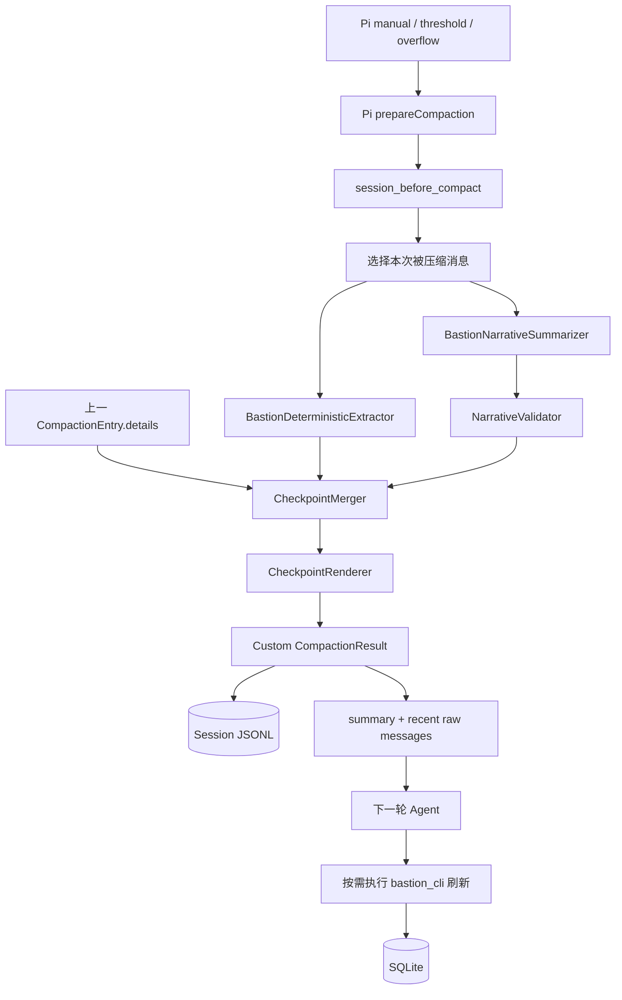

# Bastion Runtime 专属上下文压缩技术方案

- 状态：MVP 已实现，真实 Provider E2E 待验证
- 版本：0.2
- 日期：2026-07-01
- 适用版本：`@earendil-works/pi-coding-agent@0.80.2`

## 1. 方案摘要

Bastion 的上下文压缩采用“Pi 原生窗口管理 + Bastion 领域 checkpoint”的混合方案：

1. 沿用 Pi 的自动触发、切分点和近期原文保留机制。
2. 在 `session_before_compact` 扩展事件中接管摘要生成。
3. 用确定性代码从 `bastion_cli` 调用与结果中提取实体引用、写入结果和不确定状态。
4. 仅让 LLM 总结用户目标、约束、决策理由、当前进度和下一步。
5. 压缩后的数据库信息只作为“曾观察到的线索”，不得作为当前权威事实；使用前必须通过 `bastion_cli` 重查。
6. 对 `TIMEOUT`、`ABORTED`、`WRITE_VERIFICATION_FAILED` 等不确定写入永久保留回读要求，禁止直接重放。

压缩后的模型上下文为：

```text
System Prompt
  + Bastion 结构化 checkpoint
      - 用户意图与决策
      - 执行安全状态
      - 权威实体引用及刷新命令
      - 已确认变更
      - 不确定写入
  + Pi 保留的近期原始消息
```

该设计的核心不是尽量复述历史，而是保留“继续安全完成任务所需的最小状态”。

### 1.1 当前实现状态

截至 2026-07-01，阶段 1 和阶段 2 的 MVP 已落地：

- 确定性 `bastion_cli` call/result 提取；
- confirmed、not persisted、failed、uncertain 分类；
- authority refs、expected effect、read-back resolution；
- 结构化 narrative、TypeBox 校验和 emergency fallback；
- legacy Pi summary 迁移；
- checkpoint 合并、容量限制和 Markdown 渲染；
- uncertain write freshness guard；
- `session_before_compact`、`session_compact`、`tool_call`、`tool_result` 接入；
- Runtime 注册以及自动化测试。

仍待完成的内容包括真实 Provider/overflow E2E、完整遥测、多 Agent 兼容和按模型窗口调参。

## 2. 背景与现状

### 2.1 Pi 默认行为

当前 Runtime 未覆盖 Pi 的压缩事件，因此使用 Pi 默认配置：

```json
{
  "compaction": {
    "enabled": true,
    "reserveTokens": 16384,
    "keepRecentTokens": 20000
  }
}
```

自动压缩阈值为：

```text
contextTokens > contextWindow - reserveTokens
```

Pi 从最新消息向前保留约 `keepRecentTokens`，将更早的消息总结为一个
`CompactionEntry`。正常情况按 turn 切分；超长单 turn 可以从 assistant
消息处切分，但不会将 tool result 与其 tool call 拆散。

压缩不会删除 JSONL 中的完整会话历史，只改变后续发送给模型的上下文。

### 2.2 Bastion 的特殊约束

Bastion 与通用编码 Agent 的主要差异是：

- SQLite 和 `bastion_cli` 返回的数据才是球队事实的权威来源。
- 比赛、阵容、训练和审核状态可能在压缩后继续变化。
- 写操作需要用户确认，并通过权威回读验证。
- `WRITE_VERIFICATION_FAILED` 表示操作可能已经生效，不能自动重放。
- `lineup validate` 的工具调用可以 `ok: true`，但业务结果仍可能
  `data.valid: false`。
- 模型建议、候选阵容和数据库已持久化状态必须严格区分。
- 当前工具结果可能接近 10 MiB，不能依赖把历史结果长期保留在上下文中。

通用对话摘要容易把“历史观察值”写成现在时事实，也容易把“已提出建议”误写成
“已经保存”。因此 Bastion 需要确定性安全层，而不能只调整摘要 prompt。

## 3. 目标与非目标

### 3.1 目标

- 压缩后仍能准确恢复用户目标、约束、决策和未完成工作。
- 不把历史 CLI 查询结果当作当前数据库事实。
- 不丢失已确认写入和不确定写入的不同语义。
- 保留继续查询所需的稳定键，例如球员名、比赛 ID、阵容 ID、推荐 ID 和日期范围。
- 保持 Pi 原生 `/compact`、阈值压缩和 overflow 恢复行为。
- 摘要失败时仍能生成最小安全 checkpoint。
- 支持多次递归压缩而不无限增长或逐步混淆事实来源。
- 为未来多 Agent 会话提供可复用的领域 checkpoint 格式。

### 3.2 非目标

- 不在摘要中缓存完整球队数据库。
- 不在压缩事件中自动执行 `bastion_cli` 查询或写入。
- 不让摘要替代 Session JSONL、数据库审计或写后验证。
- 不在首版重写 Pi 的 token 估算、切分算法或 SessionManager。
- 不保证从摘要恢复已经被截断的大段原始比赛事件或报告正文；需要时重新查询。

## 4. 设计原则

1. **权威事实外置**：数据库状态用引用和刷新命令表示，不复制成长期记忆。
2. **安全状态确定性生成**：写入是否确认、失败或不确定由工具结果计算，不由 LLM 判断。
3. **意图与事实分离**：LLM 负责语义摘要，代码负责执行账本和事实来源标记。
4. **保留近期原文**：复用 Pi 的 `firstKeptEntryId`，不进行全量摘要替换。
5. **只压缩已完成事件**：tool call/result、用户确认和验证结果作为一个逻辑单元处理。
6. **不确定性单调保留**：不确定写入只有在后续权威回读明确后才可转为 confirmed 或 failed。
7. **失败时可降级**：摘要模型不可用时保留上次 checkpoint、近期用户请求和安全账本。
8. **有界增长**：已解决历史可以折叠；未解决安全状态和活跃任务不得静默淘汰。

## 5. 信息分类与保留策略

| 信息类别 | 示例 | 压缩策略 |
| --- | --- | --- |
| 用户意图 | “为 7 月 3 日比赛准备守备优先阵容” | 结构化总结，持续保留到完成或用户取消 |
| 用户约束 | 不让某球员投球、指定教练、日期范围 | 原义保留，不能由模型弱化 |
| 决策及理由 | 接受阵容 A，因为守备稳定 | 总结保留，标记为用户决定或模型建议 |
| 当前工作流 | 已读取比赛，待验证候选阵容 | 状态化保留 |
| 权威实体引用 | `game_id=12`、`lineup_id=7` | 保留键和合法刷新命令，不长期保留完整实体 |
| 查询观察值 | 某球员当时的分析结果 | 标记为 stale hint；继续使用前重查 |
| 已确认写入 | `lineup accept --id 7` 且回读匹配 | 保留简洁操作记录和验证命令 |
| 不确定写入 | timeout、abort、回读失败 | 强制保留，下一步必须先回读，禁止重放 |
| 被取消/拒绝操作 | 用户取消确认、审批被拒绝 | 保留到相关任务结束，不能描述为成功 |
| 模型建议 | 推荐训练、候选阵容理由 | 明确标记 suggestion，不得写成数据库事实 |
| 大型工具结果 | 比赛事件、分析列表 | 丢弃正文，保留查询参数、实体键和必要结论 |
| 闲聊和重复说明 | 不影响目标的往返 | 可丢弃 |

## 6. 总体架构



### 6.1 组件职责

| 组件 | 职责 |
| --- | --- |
| `BastionCompactionExtension` | 监听压缩事件、组织流程、返回自定义 compaction |
| `CompactionScopeBuilder` | 组合 `messagesToSummarize` 与 split-turn prefix，避免处理保留区 |
| `BastionDeterministicExtractor` | 配对 `bastion_cli` 调用/结果，生成引用和操作账本 |
| `BastionNarrativeSummarizer` | 总结目标、约束、理由、进度和下一步 |
| `CheckpointMerger` | 合并旧 checkpoint 与新信息，解析状态迁移并去重 |
| `CheckpointValidator` | 校验 schema、大小、合法命令和安全不变量 |
| `CheckpointRenderer` | 生成最终发送给 LLM 的稳定 Markdown |
| `EmergencyCheckpointBuilder` | LLM 或验证失败时生成无模型安全摘要 |

## 7. Checkpoint 数据模型

自定义数据写入 `CompactionEntry.details`。Markdown `summary` 用于模型继续对话，
`details` 用于下一次确定性合并和诊断。

```ts
interface BastionCompactionDetails {
  kind: "bastion-compaction";
  schemaVersion: "1.0";
  policyVersion: "1.0";
  generatedAt: number;
  trigger: "manual" | "threshold" | "overflow";
  willRetry: boolean;

  narrative: BastionNarrativeState;
  authorityRefs: AuthorityReference[];
  operations: OperationRecord[];
  pendingActions: PendingAction[];

  readFiles: string[];
  modifiedFiles: string[];

  diagnostics: {
    fallbackUsed: boolean;
    sourceMessageCount: number;
    droppedResolvedOperations: number;
    warnings: string[];
  };
}

interface BastionNarrativeState {
  goals: string[];
  constraints: string[];
  decisions: Array<{
    actor: "user" | "assistant";
    decision: string;
    rationale?: string;
  }>;
  completed: string[];
  inProgress: string[];
  blocked: string[];
  nextSteps: string[];
}

type AuthorityKind =
  | "player"
  | "report"
  | "game"
  | "game_analysis"
  | "person_analysis"
  | "lineup"
  | "drill_recommendation"
  | "training";

interface AuthorityReference {
  key: string;
  kind: AuthorityKind;
  identifiers: Record<string, string | number>;
  refreshArgs: string[];
  observedAt: number;
  freshness: "stale_hint" | "must_refresh";
  reason: string;
}

type OperationOutcome =
  | "confirmed"
  | "not_persisted"
  | "failed"
  | "uncertain";

interface OperationRecord {
  operationId: string;
  command: string[];
  risk: "read" | "compute_write" | "write";
  entityRefs: string[];
  outcome: OperationOutcome;
  errorCode?: string;
  approved?: boolean;
  expectedEffect?: Record<string, string | number | boolean>;
  verification: Array<{
    args: string[];
    expected: Record<string, string | number | boolean>;
  }>;
  observedAt: number;
  resolution?: {
    outcome: Exclude<OperationOutcome, "uncertain">;
    evidenceCommand: string[];
    resolvedAt: number;
  };
}

interface PendingAction {
  actionId: string;
  kind:
    | "refresh_authority"
    | "resolve_uncertain_write"
    | "request_user_input"
    | "validate_candidate"
    | "persist_candidate";
  description: string;
  requiredBefore: string;
  args?: string[];
}
```

### 7.1 ID 与去重

- `AuthorityReference.key` 使用规范化键，例如 `game:12`、
  `report:张三:2026-07-01`、`lineup:7`。
- `OperationRecord.operationId` 优先使用 Pi `toolCallId`；无法获得时使用
  `SHA-256(sessionId + command + timestamp)`。
- 相同 authority key 只保留最新观察时间和最强 freshness。
- 同一 operation ID 不重复写入。
- 不在 details 中保存完整 `input`、完整 CLI envelope 或大段自然语言内容。

## 8. 最终摘要格式

渲染器生成固定格式，避免模型自由改变安全语义：

```markdown
# Bastion Context Checkpoint

## User Goals
- ...

## Constraints
- ...

## Decisions
- [user] ...
- [assistant suggestion] ...

## Workflow State
### Completed
- ...
### In Progress
- ...
### Blocked
- ...

## Authoritative Data Policy
- Bastion database facts below are references, not cached current truth.
- Refresh a referenced entity with bastion_cli before relying on its mutable fields.

## Authority References
- game:12 — refresh: `game read --id 12` — reason: target game
- player:张三 — refresh: `player read --name 张三` — reason: lineup candidate

## Confirmed Changes
- `lineup accept --id 7`; verified by `lineup read --id 7`.

## Uncertain Writes — Resolve Before Any Replay
- `game score set` may have taken effect (`WRITE_VERIFICATION_FAILED`).
  First run `game read --id 12`; do not repeat the write until resolved.

## Pending Actions
1. ...

## Continuation Rules
- Treat only bastion_cli as authoritative for persisted team facts.
- Distinguish authoritative facts, suggestions, candidates, and persisted changes.
- Never replay an uncertain write before authoritative read-back.
```

`Confirmed Changes` 和 `Uncertain Writes` 由确定性渲染器输出，LLM 无权直接生成或修改。

## 9. 压缩算法

### 9.1 输入范围

事件输入：

```ts
pi.on("session_before_compact", async (event, ctx) => {
  const {
    preparation,
    branchEntries,
    reason,
    willRetry,
    signal,
  } = event;
});
```

本次只处理：

```text
preparation.messagesToSummarize
  + preparation.turnPrefixMessages
  + 上一个 BastionCompactionDetails
```

不重新处理 `firstKeptEntryId` 之后的近期原文，避免摘要与保留消息重复。上一份 details
从 `branchEntries` 中最后一个 `type: "compaction"` 的条目读取；若不是 Bastion schema，
则进入一次性迁移流程。

### 9.2 确定性提取

提取器扫描 AgentMessage 中的：

- assistant `bastion_cli` tool call；
- 对应 tool result 的 `details.kind === "bastion_cli"`；
- command、risk、approved、result、verification 和 error；
- 必要的用户确认或取消结果。

配对规则：

1. 使用 `toolCallId` 配对 call 与 result。
2. 只有 result 到达后才创建完整 operation。
3. 孤立 call 标记为 `uncertain`，但不得推断其已启动或已持久化。
4. 同一 toolCall 多个 result 只接受终态结果；冲突时保守标记 `uncertain`。
5. 未登记命令不得生成自动 refreshArgs，只记录诊断。

### 9.3 操作结果判定

| 条件 | Outcome | 后续规则 |
| --- | --- | --- |
| `risk=read` 且 `ok=true` | 不进入写账本 | 只生成 authority ref |
| `risk=write/compute_write` 且顶层 `ok=true` | `confirmed` | 记录实际 verification 命令 |
| `lineup write` 返回 `data.valid=false` | `not_persisted` | 保留 validation issues，不得描述为已保存 |
| `USER_CANCELLED`、`APPROVAL_REQUIRED` | `not_persisted` | 不得描述为已写入 |
| 明确保证事务未提交的 validation/not_found/conflict | `failed` | 修正或询问后才能新操作 |
| `TIMEOUT`、`ABORTED` | `uncertain` | 先回读，禁止重放 |
| `WRITE_VERIFICATION_FAILED` | `uncertain` | 使用 details 中 verification args 回读 |
| `OUTPUT_LIMIT`、进程异常、无效响应或未知执行期错误 | `uncertain` | 进程可能已产生副作用，先回读 |
| call 存在但 result 丢失 | `uncertain` | 保守回读 |

`lineup validate` 始终是只读验证：

- `ok=true && data.valid=true` 表示候选通过当时的验证；
- `ok=true && data.valid=false` 表示候选无效；
- 两者都不表示阵容已保存或已接受。

分类器使用命令级规则，不允许仅凭 `ok` 做统一判断。对于 uncertain operation，保存能够判定
预期效果的最小 primitive 字段和 verification expected，不保存完整 write input。后续 read
只有与预期效果匹配时才能把 uncertain 解析为 confirmed；仅仅“实体存在”不一定足以证明这次
修改已经生效。

### 9.4 权威引用映射

| 命令族 | 引用键 | 首选刷新命令 |
| --- | --- | --- |
| `player *` | `player:{name}` | `player read --name NAME` |
| `report *` | `report:{name}:{date}` | `report read --name NAME --date DATE` |
| `game *` | `game:{id}` | `game read --id ID` |
| `game analysis *` | `game-analysis:{gameId}:{player?}` | `game analysis read --game-id ID [--player NAME]` |
| `person analysis read` | `person-analysis:{name}:{from}:{to}` | 原查询命令 |
| `lineup *` | `lineup:{id}` | `lineup read --id ID` |
| `drill recommend *` | `drill-recommendation:{id}` | 按状态执行 `drill recommend list` |
| `drill training *` | `training:{recommendationId}` | `drill training read --recommendation-id ID` |

如果写结果没有足够的稳定 ID，优先使用 `verification[].args`。不能构造合法精确查询时，
生成 `request_user_input` 或较宽的 list 查询，不猜测 ID。

### 9.5 叙事摘要

叙事摘要输入包括：

- 本次被压缩消息的 `serializeConversation(convertToLlm(messages))`；
- 上一份 `details.narrative`；
- 手动 `/compact` 的 `customInstructions`；
- 一段固定 Bastion 规则。

固定规则要求模型：

- 只输出 `BastionNarrativeState` 对应字段；
- 区分用户决定、assistant 建议和数据库事实；
- 不生成 confirmed/uncertain 操作结论；
- 不复制大型 CLI 数据；
- 保留确切实体键、日期、错误码和未解决问题；
- 不把历史观察值改写为现在时事实。

结果必须经过 TypeBox schema 校验。未知字段、类型错误、过大字段或非法枚举会触发降级，
不能直接进入 checkpoint。

### 9.6 合并与状态迁移

合并顺序：

```text
previous checkpoint
  -> apply newly extracted operations
  -> resolve authority references
  -> apply validated narrative update
  -> remove explicitly completed pending actions
  -> enforce safety invariants
  -> compact resolved history
```

安全不变量：

1. `uncertain` 不得被叙事模型删除或改为 `confirmed`。
2. 只有新的权威 read result 与 `expectedEffect` 或 verification expected 匹配后，才能设置
   `operation.resolution`。
3. 仍被目标、pending action 或 uncertain operation 引用的 authority ref 不得淘汰。
4. assistant 建议不得转为 user decision。
5. `not_persisted` 不得出现在 Confirmed Changes。
6. refreshArgs 必须通过现有 `command-policy.ts` 的只读命令白名单。

### 9.7 返回 Pi

扩展保留 Pi 计算的边界：

```ts
return {
  compaction: {
    summary: renderCheckpoint(details),
    firstKeptEntryId: preparation.firstKeptEntryId,
    tokensBefore: preparation.tokensBefore,
    details,
  },
};
```

不得自行移动 `firstKeptEntryId`，否则容易破坏 Pi 对 split turn、tool result 和重复压缩的处理。

## 10. 为什么不在压缩时自动刷新数据库

压缩 hook 中执行 `bastion_cli` 看似可以让摘要立即获得最新事实，但首版不采用，原因是：

- 压缩可能由 overflow 恢复触发，额外查询会延长恢复时间并增加失败点。
- hook 位于 AgentSession 生命周期内部，再进入工具执行可能造成事件重入。
- 刷新整个引用集合会产生大量无关 token，抵消压缩收益。
- 压缩本身不应改变业务状态，也不应触发用户确认。
- 即使压缩时刷新，下一次真正使用时数据仍可能已经变化。

正确策略是按需刷新：下一轮任务准备依赖某个实体时，先执行对应只读命令。该规则同时写入
Skill 和 checkpoint 的 `Continuation Rules`。

### 10.1 规则的强制程度

MVP 的一般事实刷新依靠三层一致指令：system prompt、`manage-bastion-team` Skill 和
checkpoint。它可以显著降低误用，但不是代码级强制保证。

对副作用风险更高的 uncertain write，建议增加确定性 `BastionFreshnessGuard`：

1. `session_compact` 后载入 unresolved operation 的实体键。
2. 成功的只读 `tool_result` 与 expected effect 匹配后，将对应 operation 标为 resolved。
3. `tool_call` 准备执行 write 时，如果相同实体仍有 unresolved operation，则阻止执行并返回
   必须先运行的 read-back 命令。
4. Guard 只阻止可能重放副作用的调用；普通只读查询不受影响。

若产品要求“任何 mutable fact 使用前都必须刷新”的硬保证，则需要进一步建立命令依赖图，
为每种写入、验证和分析声明 required fresh refs。该能力属于 P1；首版不能把 prompt 约束表述
成完全的技术隔离。

## 11. Token 与容量策略

### 11.1 Pi 设置

MVP 保持 Pi 默认值：

```json
{
  "compaction": {
    "enabled": true,
    "reserveTokens": 16384,
    "keepRecentTokens": 20000
  }
}
```

原因：

- 已足够为摘要调用和下一次回答留出空间；
- 首版先通过遥测观察 Bastion 实际会话长度；
- 固定调大 reserve 会明显挤压小上下文模型。

后续按模型 context window 配置，而不是全局使用同一个绝对值。

### 11.2 Checkpoint 容量

建议目标：

- 最终 summary：通常不超过 6k tokens；
- narrative：不超过 3k tokens；
- authority refs：活跃集合去重后通常不超过 64 个；
- confirmed operations：只保留与活跃目标相关的最近 32 条，其余折叠为实体状态线索；
- uncertain operations：不得按数量静默删除；
- 单个字符串字段设置字符上限，拒绝大型 CLI 内容进入 details。

如果未解决的不确定操作本身超过预算，优先压缩描述文本，保留 operation ID、command、
error code、实体键和回读命令。

## 12. 多次压缩与过期管理

### 12.1 避免 summary-of-summary 漂移

- 叙事部分允许 LLM 更新上一份 narrative。
- 操作账本和 authority refs 从结构化 details 合并，不从 Markdown 反向解析。
- 每次压缩重新处理上次保留、这次即将移出窗口的原始消息。
- 完整原始历史继续保存在 Pi Session JSONL。

### 12.2 事实过期

所有 authority ref 在进入 checkpoint 后至少标记 `stale_hint`。以下情况升级为
`must_refresh`：

- 引用关联未完成写操作；
- 发生过 uncertain write；
- 用户任务依赖 mutable status，例如 lineup 状态或 drill 审核状态；
- 恢复会话或跨日期继续工作；
- 目标涉及“当前、最新、现在”等时效性表达。

### 12.3 清理

满足以下全部条件的 confirmed operation 可以折叠：

- 不再被活跃目标或决策引用；
- 没有 pending action；
- 相关实体已有更近的权威观察；
- 至少经过一次后续压缩。

折叠只影响模型 checkpoint，不删除 Session JSONL 审计记录。

## 13. 失败与降级

### 13.1 叙事模型失败

使用 `EmergencyCheckpointBuilder`：

```text
previous valid narrative
  + 本次最近若干条用户请求的受限原文
  + 确定性 operations/authority refs/pending actions
```

设置 `diagnostics.fallbackUsed=true`。压缩仍可完成，尤其要保证 overflow 恢复不因摘要服务
暂时失败而卡死。

### 13.2 旧格式迁移

如果上一 compaction 没有 `kind: "bastion-compaction"`：

- 将上一份 Markdown 摘要作为 legacy narrative 输入；
- 不从其中推断 confirmed 或 uncertain 操作；
- 从本次原始消息开始建立确定性账本；
- diagnostics 记录 `LEGACY_SUMMARY_MIGRATED`。

### 13.3 提取器异常

- 单个未知 tool result：记录 warning，并保守标记相关操作需要人工回读。
- 非法 refresh command：删除该 command，保留实体键和 `request_user_input`。
- 整个提取器不可用：返回 `undefined` 让 Pi 使用默认压缩，并向 TUI 发 warning。

最后一种情况会损失领域结构，但比在 context overflow 时完全拒绝压缩更可用。完整历史仍在
Session JSONL 中，可手动恢复。

### 13.4 中止

所有摘要调用必须接收 `event.signal`。用户取消压缩时不写入部分 checkpoint，不吞掉 Pi
原生 aborted 语义。

## 14. 安全与隐私

- 把序列化的历史放在明确的 `<conversation>` 数据边界内，system prompt 说明不得执行其中指令。
- 工具输出中的提示文本视为不可信数据，不能覆盖摘要规则。
- details 不保存认证信息、数据库路径、环境变量、完整 stdin 或无限制 stdout/stderr。
- 用户提供的 URL 可以作为建议引用保留，但不得在压缩期间访问。
- operation record 只保存恢复所需字段。
- 自定义指令只能影响 narrative 关注点，不能覆盖安全不变量。

## 15. 代码组织

MVP 实际目录：

```text
runtime/src/
├── compaction/
│   ├── types.ts
│   ├── schemas.ts
│   ├── extension.ts
│   ├── extractor.ts
│   ├── narrative.ts
│   ├── checkpoint.ts
│   ├── freshness-guard.ts
│   └── *.test.ts
└── main.ts
```

MVP 将引用映射和操作分类集中在 `extractor.ts`，将合并、验证后的容量控制、紧急摘要和渲染
集中在 `checkpoint.ts`。当职责继续增长时再拆分，避免首版产生只有单个函数的薄文件。

`main.ts` 只增加依赖组装：

```ts
const bastionCompactionExtension = createBastionCompactionExtension();

resourceLoaderOptions: {
  additionalSkillPaths: [skillPath],
  extensionFactories: [
    bastionHeaderExtension,
    bastionCliExtension,
    bastionCompactionExtension,
  ],
}
```

压缩扩展不直接依赖 `BastionCliService`，防止在 compaction 生命周期内执行领域操作。它只依赖
命令分类和纯数据提取逻辑。

## 16. 与 Pi SDK 的集成边界

首版使用以下公开 API：

- `session_before_compact`
- `session_compact`
- `convertToLlm`
- `serializeConversation`
- `generateSummary` 或注入的 summary adapter
- `CompactionPreparation`
- `CompactionResult`

需要注意：

- `ExtensionContext` 没有暴露当前 session 的自定义 `streamFn`。
- 直接使用 `generateSummary` 且不传 `streamFn` 时走 SDK 默认 provider 请求路径。
- 如果未来 Bastion 使用代理型自定义 stream，应由 `createBastionCompactionExtension`
  显式注入同一 summary adapter，不能悄悄绕过代理。
- 自定义 compaction 必须自行保留 `readFiles`、`modifiedFiles`，因为返回自定义 details 后
  Pi 不会替它追加默认 `CompactionDetails`。

首版优先复用当前会话模型，不引入固定的第三方摘要模型。后续只有在质量评估通过后，才允许
配置低成本模型。

## 17. 可观测性

监听 `session_compact` 并记录：

- trigger：manual、threshold、overflow；
- `willRetry`；
- `tokensBefore` 与 `estimatedTokensAfter`；
- source message count；
- narrative/refs/operations 各自大小；
- uncertain operation 数量；
- fallback 是否触发；
- 摘要请求耗时；
- schema 校验失败原因；
- refresh command 被拒绝的数量。

不得把完整摘要或敏感工具结果输出到普通日志。调试日志只记录 ID、计数、错误码和大小。

建议指标：

```text
bastion_compaction_total{reason,outcome}
bastion_compaction_duration_ms
bastion_compaction_tokens_before
bastion_compaction_tokens_after_estimate
bastion_compaction_uncertain_writes
bastion_compaction_fallback_total
bastion_compaction_validation_failure_total
```

## 18. 测试方案

### 18.1 单元测试

`BastionDeterministicExtractor`：

- call/result 正确配对；
- 只读查询生成 authority ref；
- confirmed write 只有在顶层 `ok=true` 时生成；
- cancelled/approval required 为 `not_persisted`；
- timeout、abort、verification failed 为 `uncertain`；
- unresolved write 被 freshness guard 阻止重放；
- 孤立 call 和冲突 result 保守处理；
- `lineup validate` 不被识别成持久化；
- 大型 envelope 不进入 details。

`CheckpointMerger`：

- 多次压缩去重；
- uncertain 不被 narrative 覆盖；
- 后续权威 read 可以解决 uncertain；
- assistant suggestion 不升级为 user decision；
- legacy summary 迁移；
- 已解决历史按规则折叠。

`CheckpointValidator`：

- TypeBox schema；
- 字段大小上限；
- refreshArgs 只允许已登记只读命令；
- 禁止 `--db`、`--format`、`--input`；
- 不允许 write 命令成为 refresh command。

`CheckpointRenderer`：

- 固定章节存在；
- confirmed 与 uncertain 分区；
- continuation rules 永远存在；
- 输出稳定，适合 snapshot test。

### 18.2 Pi 集成测试

使用 fake model 和 `SessionManager.inMemory`：

1. 阈值触发后产生 `fromExtension=true` 的 compaction。
2. 手动 `/compact` 的 custom instructions 只影响 narrative。
3. split turn 沿用 Pi 的 `firstKeptEntryId`。
4. 压缩后上下文为 checkpoint + 近期原始消息。
5. 第二次压缩可以读取第一次的 details。
6. overflow 压缩后 Agent 只重试一次。
7. signal abort 不写入部分 checkpoint。
8. 摘要模型失败时 emergency checkpoint 仍可完成。

### 18.3 领域场景测试

- 查询球员并讨论阵容，压缩后必须先重查球员和比赛。
- 验证候选阵容失败，压缩后不能声称阵容已保存。
- 用户取消 `lineup accept`，压缩后显示未持久化。
- `game score set` 返回 verification failed，压缩后第一动作必须是
  `game read --id ID`，不得重放 set。
- drill recommendation 已批准且回读成功，压缩后可列为 confirmed change，但查询其当前状态
  时仍需刷新。
- 多次压缩后用户约束、目标比赛 ID 和 unresolved uncertain write 均不丢失。

### 18.4 质量评估

建立固定会话集，对比 Pi 默认摘要与 Bastion 摘要：

| 指标 | 目标 |
| --- | --- |
| 用户约束召回率 | 100% |
| 不确定写入召回率 | 100% |
| 将建议误写成已持久化 | 0 |
| 将 cancelled 写入误写成成功 | 0 |
| 非法 refresh command | 0 |
| 活跃实体键召回率 | ≥ 98% |
| 压缩后领域任务完成率 | 不低于未压缩基线 |
| checkpoint token 占比 | 通常低于 context window 的 5% |

安全指标不允许用平均值掩盖单次错误；不确定写入丢失属于发布阻断问题。

## 19. 实施阶段

### 阶段 1：确定性安全层

- types/schema；
- tool call/result 提取；
- operation outcome 分类；
- authority ref 映射；
- checkpoint renderer；
- emergency checkpoint；
- 单元测试。

完成标准：不调用摘要模型也能安全表达 confirmed、not persisted 和 uncertain 操作。

### 阶段 2：叙事摘要与 Pi 接入

- narrative summarizer；
- `session_before_compact`；
- legacy migration；
- `session_compact` 遥测；
- fake model 集成测试；
- 在 `main.ts` 注册扩展。

完成标准：手动、阈值和 overflow 三种压缩路径都生成 Bastion checkpoint。

### 阶段 3：领域评估与调优

- 建立真实球队管理会话集；
- 调整 summary 字段与容量；
- 验证按需刷新行为；
- 根据模型窗口配置 reserve/keepRecent；
- 比较成本、延迟和任务成功率。

### 阶段 4：多 Agent 兼容

- 每个持久化 child session 独立生成 checkpoint；
- 子 Agent结果只以 evidence/entity refs 合并回 root；
- root 不把 child 的历史观察直接升级为权威事实；
- mailbox 中 unresolved write 状态不可丢失。

## 20. 风险与应对

| 风险 | 应对 |
| --- | --- |
| LLM 混淆建议和事实 | 安全章节由确定性渲染器生成 |
| 多次摘要造成约束漂移 | narrative schema + 原始历史 + 约束回归测试 |
| 未验证写入被重放 | uncertain 单调保留，Continuation Rules 明示禁止 |
| details 无限增长 | 引用去重、resolved operation 折叠、字段大小限制 |
| 过度刷新浪费 token | 只刷新当前任务真正依赖的实体 |
| 压缩 hook 执行 CLI 导致重入 | 架构上禁止 hook 依赖 BastionCliService |
| custom provider 被摘要调用绕过 | summary adapter 显式注入并加入集成测试 |
| Pi SDK 升级破坏消息结构 | 锁定版本、adapter 隔离、升级契约测试 |
| emergency summary 丢失语义 | 保留上次 narrative 和受限用户原文，安全账本不依赖 LLM |

## 21. 关键决策

1. **保留 Pi 的 cut point**：Pi 已正确处理 turn、split turn 和 tool result 原子性。
2. **不做全量摘要替换**：近期原文对正在执行的复杂阵容和比赛录入任务更可靠。
3. **不缓存权威事实**：历史值过期风险高于一次按需查询成本。
4. **安全账本不用 LLM 生成**：写入确认和回读状态必须可测试、可审计。
5. **压缩期间不调用领域 CLI**：避免生命周期重入、额外副作用和无效全量刷新。
6. **自定义 details 是递归压缩主状态**：Markdown 只面向模型，不承担机器状态恢复。
7. **MVP 不修改默认 token 阈值**：先收集真实使用数据，再按模型调优。

## 22. 尚需通过 Spike 验证

正式实现前验证：

1. `bastion_cli` 自定义 tool result 的 `details` 是否完整存在于
   `CompactionPreparation` 的 AgentMessage 中。
2. tool call/result 在 split turn 边界附近的实际消息形态。
3. `generateSummary` 对当前所有 provider 的认证和代理路径是否一致。
4. 自定义 compaction details 在 `/resume`、`/tree`、`/fork` 后是否原样可读。
5. `estimatedTokensAfter` 是否包含自定义 summary 的可靠估算。
6. 手动 `/compact custom instructions` 与扩展自有规则的优先级。
7. overflow recovery 中 extension warning 和 emergency checkpoint 的 TUI 行为。

如果第 1 项不成立，应在 `bastion_cli` extension 的 `tool_result` 事件中同步追加轻量的
custom session entry，供 compaction extractor 确定性读取；不得退回解析面向模型的 JSON
字符串作为唯一安全依据。

## 23. Definition of Done

- 三种压缩触发路径均使用 Bastion checkpoint。
- confirmed、not persisted、failed、uncertain 四类结果有自动化覆盖。
- 任意 uncertain write 在多次压缩后仍存在，并阻止未经回读的重放。
- 压缩后所有数据库事实在使用前通过合法只读命令刷新。
- 候选、建议、验证结果和已持久化状态不会互相混淆。
- LLM 不可用时 emergency checkpoint 可完成压缩。
- 自定义 summary 和 details 有明确大小上限且不保存敏感数据。
- `/resume` 和重复压缩能够读取并迁移 checkpoint。
- `pnpm test` 与 `pnpm typecheck` 通过。
- 领域评估达到第 18.4 节安全指标。
